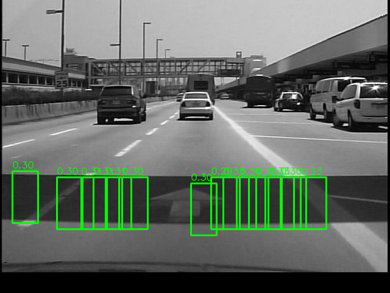
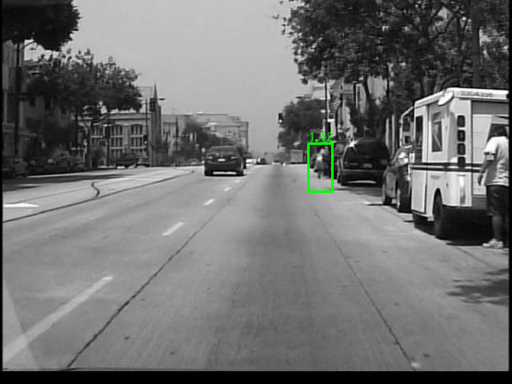
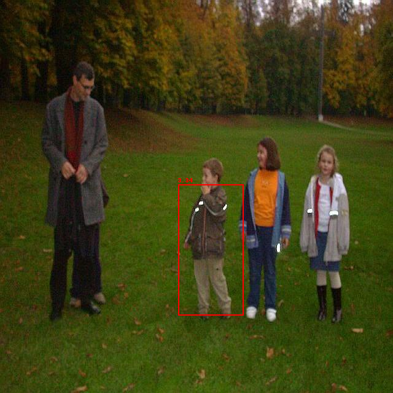
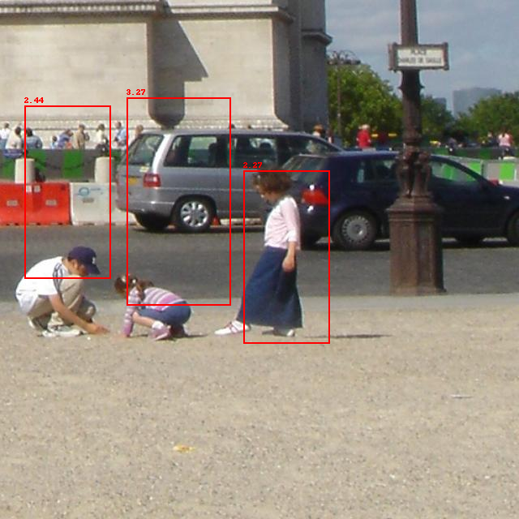
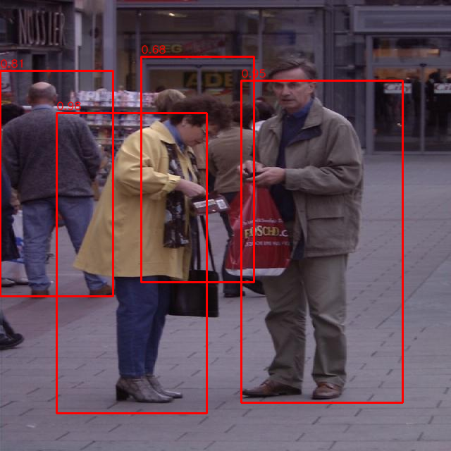
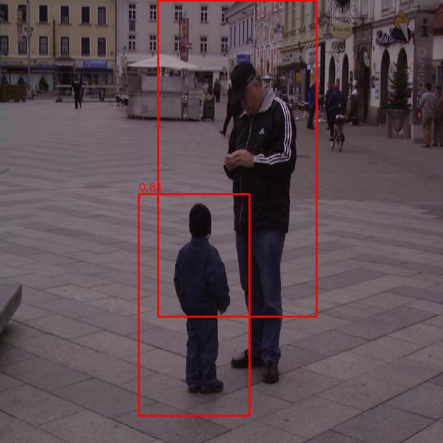
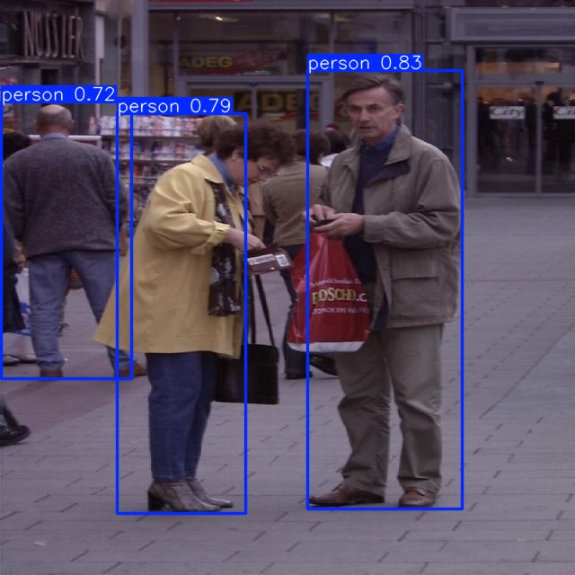

# Détection et Suivi de Piétons  
**Haar/SVM · HOG/SVM · YOLOv8s · DeepSORT · ByteTrack**

Projet du cours — Université de Moncton  
Auteur : **Ousmane Maiga**  
Superviseur : **Pr. Moulay Akhloufi – PRIME Lab**

---

# 1. Description du projet

Ce projet compare trois approches de **détection de piétons** :

- Haar + SVM  
- HOG + SVM  
- YOLOv8s (meilleur modèle)

et deux algorithmes de **suivi multi-objets** :

- DeepSORT (avec ReID MobileNet)  
- ByteTrack  

Objectifs :

- analyser pourquoi les détecteurs classiques échouent en scène réelle  
- étudier la généralisation cross-dataset (Caltech ↔ INRIA)  
- mesurer l’impact de la qualité des détections sur le tracking  
- produire des résultats visuels + deux vidéos finales de suivi  

---

## 2. Structure du projet

```text
projet_detection_suivi_pietons/
├── README.md
├── train_yolo.slurm
├── images/
│   ├── haar_caltech_1.png
│   ├── haar_caltech_2.png
│   ├── haar_inria_1.png
│   ├── haar_inria_2.png
│   ├── hog_inria_1.png
│   ├── hog_inria_2.png
│   ├── yolo_inria_1.jpg
│   └── yolo_inria_2.jpg
├── videos/
│   ├── DeepSort.mp4
│   └── ByteTrack.mp4
├── models/
│   └── caltech.pt       ← meilleur modèle YOLOv8s (entraîné sur Caltech)
├── scripts/
│   ├── feature_haar_inria.py
│   ├── features_hog_inria.py
│   ├── patch_and_negatifs_inria.py
│   ├── entrainement_svm_inria.py
│   ├── entrainement_svm_hog_inria.py
│   ├── detect_inria_svm.py
│   ├── detect_inria_hog_svm.py
│   ├── track_ReID_deepsort.py
│   ├── eval_MOT.py
│   ├── convert_pred_to_MOT.py
│   ├── convert_kitti_GT_to_MOT.py
│   ├── extract_images.py
│   ├── extract_annotations.py
│   ├── convertir_vbb.py
│   ├── video_to_frames.py
│   └── images_to_videos.py
│── config/
│   ├── data_caltech.yaml
│   ├── data_inria.yaml
│   └── liste_chemin_image.sh
└── README_logs
```
---

# 3. Téléchargement des datasets (liens officiels)

Télécharger les datasets depuis les liens officiels car trop volumineux :

### 🔹 **Caltech Pedestrian Dataset**  
https://www.vision.caltech.edu/Image_Datasets/CaltechPedestrians/

### 🔹 **INRIA Person Dataset**  
https://github.com/olt/inria-object-detection

### 🔹 **KITTI Tracking Dataset**  
https://www.cvlibs.net/datasets/kitti/eval_tracking.php

Créer ensuite :

datasets/Caltech/
datasets/INRIA/
datasets/KITTI/


---

# 4. Exemples de détection 

### Haar + SVM (Caltech - Caltech & INRIA - INRIA)

<p align="center">
  
  
</p>

<p align="center">
  
  
</p>

### HOG + SVM (INRIA - INRIA)

<p align="center">
  
  
</p>

### YOLOv8s (Caltech - INRIA)

<p align="center">
  
  
</p>

---

# 5. Résultats de suivi 

Les vidéos sont dans :  
videos/DeepSort.mp4 et
videos/ByteTrack.mp4


### DeepSORT

[Voir la vidéo DeepSORT](videos/DeepSort.mp4)

### ByteTrack

[Voir la vidéo ByteTrack](videos/ByteTrack.mp4)

---

# 6. Entraînement YOLOv8s (Caltech)

### SLURM (Cluster Trilium)
sbatch projet_detection_suivi_pietons/train_yolo.slurm


### Informations d’exécution  
- GPU : 4  
- Temps total : **2 h 05 min 41 s**  
- Modèle obtenu → **modeles/yolov8s/caltech_person/weights/best.pt**

---

# 7. Évaluation YOLOv8s

### ✔ Caltech → INRIA


yolo detect val model=models/caltech/best.pt data=config/data_inria.yaml split=test

→ **mAP@50 = 0.689**

---

# 8. Suivi DeepSORT

python track_ReID_deepsort.py
--img_dir path/imgs
--dets_dir path/yolo_preds
--out_dir output/
--embedder mobilenet
--max_age 10 --n_init 3 --max_cosine_distance 0.4


Sorties :
- images annotées  
- labels YOLO + track_id

---

# 9. Reproductibilité complète

## (1) Télécharger datasets  
→ Voir section 3

## (2) Convertir Caltech (.seq + .vbb → images + YOLO)
python convertir_vbb.py
python extract_images.py
python extract_annotations.py

## (3) Générer splits
bash config/liste_chemin_image.sh

## (4) Entraîner YOLO
sbatch train_yolo.slurm


## (5) Suivi
python track_ReID_deepsort.py ...
python bytetrack.py ...

---

# 10. Modèle final utilisé

models/caltech/best.pt

---