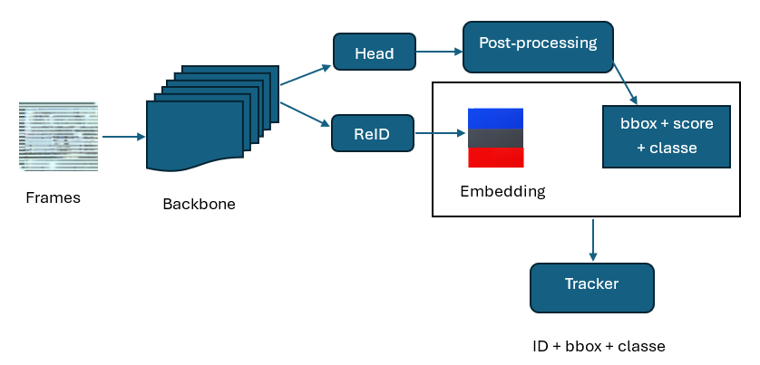

# TL;DR — Exécuter le projet en quelques temps

git clone [<URL_DU_REPO>](https://github.com/Oussou-MAIGA/Pedestrian-Detection-and-Multi-Object-Tracking-MOT-Using-YOLOv8-and-DeepSORT.git)

cd Pedestrian-Detection-and-Multi-Object-Tracking-MOT-Using-YOLOv8-and-DeepSORT


# Installer les dépendances (pour installation locale)
pip install -r requirements.txt

# Télécharger les datasets (Section 3)
# puis entraîner YOLO :
yolo detect train model=yolov8s.pt data=config/data_caltech.yaml

# Évaluer Caltech → INRIA :
yolo detect val model=modeles/caltech_person/weights/best.pt data=config/data_inria.yaml

# Lancer DeepSORT :
python scripts/track_ReID_deepsort.py --img_dir ... --dets_dir ...

# Lancer ByteTrack :
yolo track model=modeles/caltech_person/weights/best.pt tracker=bytetrack.yaml source=...


---

# Technologies utilisées

<p align="left">

  <!-- Python -->
  

  <!-- Ultralytics -->
  

  <!-- OpenCV -->
  

  <!-- Scikit-learn -->
  

  <!-- PyWavelets -->
  

  <!-- DeepSORT -->
  

  <!-- ByteTrack -->
  

  <!-- SLURM -->
  

  <!-- GPU -->
  

</p>

---

# Détection et Suivi de Piétons  
**Haar/SVM · HOG/SVM · YOLOv8s · DeepSORT (ReID MobileNet) · ByteTrack**

Projet du cours — Université de Moncton  
Auteur : **Ousmane MAIGA**  
Superviseur : **Pr. Moulay AKHLOUFI – PRIME Lab**

---

# 1. Description du projet

<p align="center">
  
</p>


Ce projet compare trois approches de **détection de piétons** :

- Haar + SVM  
- HOG + SVM  
- YOLOv8s (meilleur modèle)

et deux méthodes de **suivi multi-objets** :

- DeepSORT (avec ReID MobileNet)  
- ByteTrack (implémentation Ultralytics)

Objectifs :

- analyser pourquoi les détecteurs classiques échouent en scène réelle  
- étudier la généralisation cross-dataset (**Caltech → INRIA**)  
- mesurer l’impact de la qualité des détections sur le tracking  
- produire des résultats visuels et deux vidéos finales de suivi

---

# 2. Structure du projet

```text
projet_detection_suivi_pietons/
│
├── README.md
├── train_yolo.slurm
├── requirements.txt
│
├── images/                 # résultats de détection pour le rapport / README
│   ├── haar_caltech_1.png
│   ├── haar_caltech_2.png
│   ├── haar_inria_1.png
│   ├── haar_inria_2.png
│   ├── hog_inria_1.png
│   ├── hog_inria_2.png
│   ├── yolo_caltech_inria_1.jpg
│   └── yolo_caltech_inria_2.jpg
│
├── videos/                 # résultats de suivi (DeepSORT / ByteTrack)
│   ├── DeepSort.mp4
│   └── ByteTrack.mp4
│
├── modeles/
│   └── caltech_person/
│       └── weights/
│           └── best.pt    # meilleur modèle YOLOv8s (entraîné sur Caltech)
│
├── datasets/               # à remplir via les liens officiels (Section 3)
│   ├── Caltech/
│   ├── INRIA/
│   └── kitti_tracking/
│
├── scripts/
│   ├── feature_haar_inria.py
│   ├── features_hog_inria.py
│   ├── patch_and_negatifs_inria.py
│   ├── entrainement_svm_inria.py
│   ├── entrainement_svm_hog_inria.py
│   ├── detect_inria_svm.py
│   ├── detect_inria_hog_svm.py
│   ├── track_ReID_deepsort.py
│   ├── eval_MOT.py
│   ├── convert_Pred_to_MOT.py
│   ├── convert_kitti_GT_to_MOT.py
│   ├── extract_images.py
│   ├── extract_annotations.py
│   ├── convertir_vbb.py
│   ├── video_to_frames.py
│   └── images_to_videos.py
│
└── config/
    ├── data_caltech.yaml
    ├── data_inria.yaml
    └── liste_chemin_image.sh


```

# 3. Datasets (liens officiels)
Les datasets sont trop volumineux pour être versionnés.
Ils doivent être téléchargés depuis les sites officiels puis placés dans datasets/.

🔹 Caltech Pedestrian
Site : https://www.kaggle.com/datasets/kalvinquackenbush/caltechpedestriandataset

Dossier cible : datasets/Caltech/

Les scripts convertir_vbb.py, extract_images.py, extract_annotations.py
permettent de convertir .seq + .vbb → images + labels YOLO.

🔹 INRIA Person
Repo : https://www.kaggle.com/datasets/jcoral02/inriaperson

Dossier cible : datasets/INRIA/

🔹 kitti_tracking 
Site : https://www.kaggle.com/datasets/leducnhuan/kitti-tracking

Dossier cible : datasets/kitti_tracking/

Une fois par exemple les archives kitti_tracking extraites, vous obtenez la structure officielle suivante :

```text
datasets/kitti_tracking/
    └── training/
        └── image_02/
            ├── 0000/
            ├── 0001/
            ├── 0012/
            ├── 0019/
            └── ...
```

L’idée est simplement de placer les images de tracking dans datasets/kitti_tracking/...
en respectant l’organisation native de kitti_tracking.

# 4. Résultats de détection

Haar + SVM (Caltech - Caltech/ INRIA - INRIA)
<p align="center">   </p> <p align="center">   </p>
HOG + SVM (INRIA - INRIA)
<p align="center">   </p>
YOLOv8s (modèle entraîné sur Caltech, testé sur INRIA)
<p align="center">   </p>

# 5. Résultats de suivi
Les vidéos finales de suivi sont dans :

[Voir la vidéo Bytetrack](https://bizoffice4827-my.sharepoint.com/:v:/g/personal/technicien_mrp92_fr/IQAaIrXX4PK9TIhSjS7_q021AbbQRkKVM1pONkk9cDbHsRI?e=ok9DhC)

ou

[Voir la vidéo DeepSort](https://bizoffice4827-my.sharepoint.com/:v:/g/personal/technicien_mrp92_fr/IQBHNRAXR811TrvHZ0TlRg96AX2TmrvCqu6MQ3_LM9kQlb8?e=KR0Vzy)


# 6. Environnement logiciel (Cluster Trilium)
Sur le cluster Trilium, avant d’exécuter l’entraînement ou les évaluations YOLO,
les modules et bibliothèques suivants sont chargés / installés :

module load python/3.11.5
module load gcc opencv/4.12.0 python script-stick

# activation de l'environnement virtuel (exemple)
source /chemin/vers/mon_env/bin/activate

# installation des dépendances
pip install --no-index \
  -f /cvmfs/soft.computecanada.ca/custom/python/wheelhouse/generic \
  pywavelets scikit-learn ultralytics

Ces commandes sont exécutées avant :

sbatch train_yolo.slurm

yolo detect val ...

yolo detect predict ...

yolo track ...

# 7. Modèle YOLOv8s (base + fine-tuning)
## 7.1 Modèle de base (pré-entraîné COCO)
Fichier : yolov8s.pt

Téléchargement officiel :
https://github.com/ultralytics/assets/releases/download/v8.2.0/yolov8s.pt

Ce modèle est utilisé dans train_yolo.slurm comme point de départ :

MODEL="yolov8s.pt"

## 7.2 Modèle final (fine-tuné sur Caltech)
Le fine-tuning sur Caltech produit le meilleur modèle du projet (celui utilisé dans l’article) :

modeles/caltech_person/weights/best.pt
Ce modèle :

- est entraîné sur Caltech (train),

- est évalué sur Caltech (test) dans le script SLURM (yolo val split=test),

- est ensuite réutilisé pour l’évaluation Caltech → INRIA (cross-dataset),

- sert de modèle unique pour tous les tests et pour les deux trackers (DeepSORT et ByteTrack).

# 8. Entraînement YOLOv8s sur Caltech
L’entraînement se fait via le script SLURM : sbatch train_yolo.slurm

Dans ce script :

model=$MODEL pointe vers yolov8s.pt (modèle de base COCO),

data=config/data_caltech.yaml décrit les chemins du dataset Caltech converti en format YOLO,

les paramètres par défaut (batch, epochs, etc.) sont ajustés pour le cluster.

À la fin de l’entraînement, on valide  sur le split test de Caltech pour les performances officielles:

yolo detect val \
  model=modeles/caltech_person/weights/best.pt \
  data=config/data_caltech.yaml \
  split=test

Ce yolo val fournit les performances officielles Caltech → Caltech
utilisées dans le rapport (mAP@50, F1, etc.).

Temps d’exécution observé sur Trilium :

~ 2 h 05 min 41 s sur 4 GPUs (H100).

# 9. Évaluation YOLOv8s (cross-dataset Caltech → INRIA)
Après l’entraînement sur Caltech, on réutilise le même modèle :

yolo detect val \
  model=modeles/caltech_person/weights/best.pt \
  data=config/data_inria.yaml \
  split=test

Résultat principal (Caltech → INRIA) :

mAP@50 ≈ 0.689

F1 et PR détaillés dans l’article (courbes PR/F1 + matrice de confusion): **Etude Comparative des techniques de Detection et Suivi de Pietons**

Dans cet article, c’est ce cas Caltech → INRIA qui est considéré comme
meilleur scénario global (modèle entraîné sur un dataset plus difficile et testé sur un plus simple).

# 10. Suivi multi-objets
## 10.1 DeepSORT (ReID MobileNet)

DeepSORT n’est pas intégré directement dans Ultralytics :
on utilise le script Python track_ReID_deepsort.py, qui prend en entrée :

les images kitti_tracking pour une séquence (ex. 0019),

les détections YOLOv8s au format e (.txt) générées par Ultralytics,

un dossier de sortie pour les frames annotées et les labels avec ID.

### 10.1.1 Générer les détections YOLO sur kitti_tracking

yolo detect predict \
  model=modeles/caltech_person/weights/best.pt \
  source=datasets/kitti_tracking/training/image_02/0019 \
  imgsz=1408 \
  conf=0.60 \
  save=True \
  save_txt=True \
  project=runs/detect \
  name=kitti_tracking_0019_yolo

Cela produit une structure de ce type :

```text
runs/detect/kitti_tracking_0019_yolo/
 ├── 000000.png
 ├── 000001.png
 ├── ...
 └── labels/
      ├── 000000.txt    # cls cx cy w h conf
      ├── 000001.txt
      └── ...

```

### 10.1.2 Lancer DeepSORT


python scripts/track_ReID_deepsort.py \
  --img_dir  datasets/kitti_tracking/training/image_02/0019 \
  --dets_dir runs/detect/kitti_tracking_0019_yolo/labels \
  --out_dir  runs/tracking/deepsort_0019 \
  --embedder mobilenet \
  --max_age 10 \
  --n_init 3 \
  --max_cosine_distance 0.4

Paramètres principaux :

--img_dir : images kitti_tracking d’une séquence (ex. 0019)

--dets_dir : fichiers .txt YOLO générés par yolo detect predict

--out_dir : dossier de sortie des résultats DeepSORT

--embedder : modèle ReID utilisé (mobilenet)

--max_age : durée de vie d’une piste sans détection

--n_init : nombre de frames nécessaires pour valider une piste

--max_cosine_distance : seuil d’acceptation pour la similarité d’apparence

Résultats :

```text
runs/tracking/deepsort_0019/
 ├── frames/
 │    ├── 000000.png      # image annotée (bbox + ID)
 │    ├── 000001.png
 │    └── ...
 └── labels/
 │    ├── 000000.txt      # cls cx cy w h track_id
 │    ├── 000001.txt
 │    └── ...
 └── deepsort_0019.mp4 # vidéo finale
```

Les vidéos finales visibles dans videos/deepsort.mp4 sont construites
à partir de ces frames via images_to_videos.py ;

python scripts/images_to_videos.py \
  --input_dir runs/tracking/deepsort_0019/frames \
  --output_path runs/tracking/deepsort_0019/videos/deepsort_0019.mp4 \
  --fps 10

Paramètres :
	– input_dir : dossier contenant les images annotées
	– output_path : nom de la vidéo générée
	– fps : nombre d’images par seconde (10 car pas assez d'image pour kitti_tracking)

## 10.2 ByteTrack (Ultralytics)

ByteTrack est intégré dans Ultralytics via `yolo track`.  
Dans notre workflow, comme pour DeepSORT, `yolo track` génère **des images annotées**  
et **non pas directement une vidéo**.  
La vidéo finale est construite ensuite avec `images_to_videos.py`.

### 10.2.1 Générer les images ByteTrack

yolo track \
  model="modeles/caltech_person/weights/best.pt" \
  source="datasets/kitti_tracking/training/image_02/0019" \
  imgsz=1408 \
  conf=0.60 \
  tracker="bytetrack.yaml" \
  save=True \
  save_txt=True \
  save_json=True \
  project="runs/tracking" \
  name="bytetrack_0019/frames"

model= : modèle YOLOv8s fine-tuné sur Caltech

source= : dossier d’images kitti_tracking pour une séquence

tracker="bytetrack.yaml" : active ByteTrack

save=True : enregistre automatiquement

save_txt=True : enregistre les labels avec track_id

save_json=True : exporte les résultats en JSON (format MOT-compatible)

Sorties typiques :

```text

runs/tracking/bytetrack_0019
 ├── frames/       
 │    ├── 000000.png      # image annotée (bbox + ID)
 │    ├── 000001.png
 │    └── ...
 ├── labels/
 │    ├── 000000.txt           # cls cx cy w h track_id
 │    ├── 000001.txt
 │    └── ...
 └── predictions.json          # résultats pour évaluation MOT

```

### 10.2.2 Construire la vidéo ByteTrack

Comme pour DeepSORT, les frames générées sont converties en vidéo :

python scripts/images_to_videos.py \
  --input_dir runs/tracking/bytetrack_0019/frames \
  --output_path runs/tracking/bytetrack_0019/videos/bytetrack_0019.mp4 \
  --fps 10


Paramètres :

input_dir : dossier contenant les images annotées

output_path : vidéo finale

fps : 10 (adéquat pour KITTI car peu d'images)

La vidéo obtenue est ensuite copiée dans : videos/ByteTrack.mp4

Ces fichiers (labels) peuvent ensuite être convertis et évalués avec :

scripts/convert_Pred_to_MOT.py

scripts/eval_MOT.py

pour obtenir les métriques IDF1, MOTA, etc., comme dans l’article.

# 11. Reproductibilité (résumé)

- Charger l’environnement Trilium (Section 6)

- Télécharger et placer les datasets (Section 3)

- Convertir Caltech en images + YOLO (scripts convertir_vbb.py, extract_images.py, extract_annotations.py)

- Générer les splits :
   config/liste_chemin_image.sh  (mais sera gérer par le slurm ci-dessous donc ignorer cette étape)

- Entraîner YOLOv8s sur Caltech :

- sbatch train_yolo.slurm
- dos2unix train_yolo.slurm

 → modèle : modeles/caltech_person/weights/best.pt
 → validation automatique Caltech → Caltech (yolo val split=test)

- Évaluer Caltech → INRIA :

 yolo detect val \
   model=modeles/caltech_person/weights/best.pt \
   data=config/data_inria.yaml \
   split=test

- Générer les détections kitti_tracking (pour le tracking) avec yolo detect predict.

- Lancer DeepSORT avec track_ReID_deepsort.py.

- Lancer ByteTrack avec yolo track ... tracker="bytetrack.yaml".

# 12. Modèle final du projet
Le modèle unique utilisé dans tous les résultats de l’article est : modeles/caltech_person/weights/best.pt
- entraîné sur Caltech

- évalué sur Caltech (officiel) via yolo val split=test

- testé en cross-dataset Caltech → INRIA (meilleure configuration)

- utilisé pour DeepSORT et ByteTrack sur kitti_tracking.

---

# Contact

Pour toute question concernant le projet, vous pouvez contacter :

**Ousmane MAIGA**  
**eom6713@umoncton.ca**

